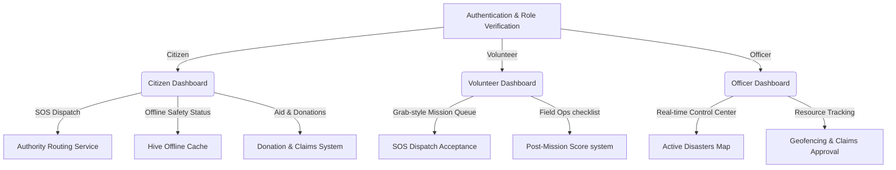

# ⚡ SIGAP — Sistem Integrasi Gerak Awam Pantas
<div align="center">
  
  
  
  
</div>

<br/>

**SIGAP** (meaning *"alert"* or *"fast"* in Malay) is a Flutter-based mobile crisis response and emergency coordination platform designed for Malaysia's disaster management (e.g., floods, fires, landslides, medical crises). It bridges the gap between **Citizens**, **Volunteers**, and **Government Agencies (e.g., NADMA, Bomba, PDRM)**, ensuring instant help and coordinate efforts when every second counts.

---

## 🌟 Key Pillars & User Workflows



### 🏠 1. The Citizen Workflow
* **SOS One-Tap Dispatch**: Instant emergency broadcast using geocoding to retrieve the citizen's current location, allowing them to report incident types (Flood, Fire, Medical, Missing Person).
* **Malaysian Authority Routing**: Powered by [AuthorityRoutingService](file:///c:/Users/User/Downloads/SIGAP/lib/services/authority_routing_service.dart), SOS broadcasts automatically route to the corresponding emergency agency:
  * 🚒 **Bomba (994)**: Fire & structural rescue.
  * 🚑 **Ambulance (999)**: Accidents & critical medical events.
  * 👮 **PDRM (999)**: Crimes, missing persons, or public safety issues.
  * 🌊 **NADMA (03-8064 2400)**: Flood & landslide disaster zones.
* **Active Flood Warnings (Amaran Banjir)**: Real-time pop-up banner alerting citizens of active flood warnings in their proximity, linking to crisis centers and evac directions.
* **Family Safety Tracker (Keselamatan Keluarga)**: Real-time tracking of family members' safety status (*Safe, Evacuated, In Danger*).
* **Donations & Transparent Claims**: Citizens can browse active donation campaigns, donate directly, view transparency reports, and download generated PDF receipts.

### 🤝 2. The Volunteer Workflow
* **Active/Inactive Status Toggle**: Controls the volunteer's availability for incoming emergency assignments in their area.
* **Grab-Style Dispatch Queue**: Real-time incident feed of pending SOS dispatches. Volunteers can review incident details, location coordinates, and accept the mission.
* **Interactive Mission Checklists**: Step-by-step guides for active rescue missions, detailing supplies to deliver, victims to evacuate, and field reports.
* **SIGAP Mata & Rewards**: Earn points for completing volunteer missions, redeemable for certificates endorsed by civil defense organizations.

### 🏛️ 3. The Government Officer Workflow
* **Command & Control Dashboard**: Centralized console showing live cluster distribution of SOS incidents and location mappings.
* **Disaster Geofencing**: Define active disaster borders to restrict access or notify citizens in high-risk zones.
* **Resource and Claim Operations**: Manage and approve relief aid claims submitted by affected citizens and track inventory distribution.

---

## 🛠️ Technical Stack & Architecture

### Frontend Architecture (MVVM + Bloc)
* **Framework**: Flutter 3 (Dart `sdk: '>=3.0.0 <4.0.0'`)
* **State Management**: `flutter_bloc` (v9.1.1) for decoupling business logic from UI elements.
* **Routing**: `go_router` (v15.1.2) implementing declarative role-based routing.
* **Localization**: `easy_localization` (v3.0.7) for complete, context-aware dual-language support (English & Bahasa Melayu).
* **Offline Caching**: `hive_flutter` (v1.1.0) local storage cache for backup guides and safety checklists.

### Cloud Integration (Firebase)
* **Firebase Auth**: Role-Based Access Control (RBAC) securely restricting and onboarding Citizens, Volunteers, and Officers. Includes re-authentication workflows for password changes.
* **Cloud Firestore**: Real-time synchronization of SOS signals, user profiles, volunteer statuses, and donation transactions.
* **Firebase Messaging (FCM)**: Push notifications for immediate dispatch warnings.

---

## 📁 Repository Structure

```
SIGAP/
├── assets/
│   ├── sounds/              # Alert ringtones and dispatch notification sounds
│   └── translations/        # Localization files
│       ├── en.json          # English locale keys
│       └── ms.json          # Bahasa Melayu locale keys
├── android/
│   ├── app/
│   │   └── build.gradle.kts # Kotlin DSL Gradle settings (Desugaring Enabled)
│   └── build.gradle.kts
├── lib/
│   ├── blocs/               # BLoC State Management blocks (e.g. AuthBloc)
│   ├── core/
│   │   ├── constants/       # Global constants (Colors, Route Names)
│   │   └── theme/           # Premium Material 3 Dark/Light styling
│   ├── models/              # Strongly-typed data models (Citizen, Volunteer, Officer)
│   ├── screens/             # Dedicated screens arranged by role and auth state
│   │   ├── auth/            # Login, Registration, Password Reset, Onboarding
│   │   ├── citizen/         # Dashboards, Profiles, Donation Campaigns
│   │   ├── officer/         # Incident heatmaps, relief claim approvals
│   │   └── volunteer/       # Mission checksheets, SOS Accept/Decline list
│   ├── services/            # Service modules (Auth, Firestore, Location, Notification)
│   └── widgets/             # Reusable custom styled Material 3 components
├── pubspec.yaml             # Main project specifications
└── README.md                # Project documentation
```

---

## ⚡ Android Build Configuration (Java 8 Desugaring)

> [!IMPORTANT]
> The `flutter_local_notifications` package utilizes Java 8+ features (`java.time` APIs). To compile on Android targets, **Core Library Desugaring** is enabled in the Kotlin DSL configuration.

If you modify the build dependencies, verify that [android/app/build.gradle.kts](file:///c:/Users/User/Downloads/SIGAP/android/app/build.gradle.kts) includes:

```kotlin
android {
    compileOptions {
        isCoreLibraryDesugaringEnabled = true
        sourceCompatibility = JavaVersion.VERSION_17
        targetCompatibility = JavaVersion.VERSION_17
    }
}

dependencies {
    coreLibraryDesugaring("com.android.tools:desugar_jdk_libs:2.1.4")
}
```

---

## 🚀 Getting Started

### 📋 Prerequisites
Confirm your machine meets these requirements:
* **Flutter SDK**: `3.10.x` or higher
* **Java JDK**: Version 17
* **Android Studio**: Installed with SDK Tools and an active Virtual Device (API Level 30+) or a developer-unlocked physical Android device connected via USB.

### 🔌 Running the Project

1. **Clone & Open**: Open the `SIGAP` directory in your IDE of choice (VS Code recommended).
2. **Retrieve Dependencies**: Open a terminal in the project root and run:
   ```bash
   flutter pub get
   ```
3. **Run Code Generation**: Generate Hive type adapters if required:
   ```bash
   flutter pub run build_runner build --delete-conflicting-outputs
   ```
4. **Launch Application**: Ensure your emulator or physical device is detected by executing `flutter devices`, then boot the app in debug mode:
   ```bash
   flutter run
   ```

> [!NOTE]
> This repository is pre-configured with a shared Firebase project containing correct Firebase configuration keys. You do not need to register a new Firebase project to get started.

---

## 🧩 Reusable Design Components

All shared widgets are housed under `lib/widgets/` to ensure a consistent, premium user experience:

| Component | Features | Purpose |
| :--- | :--- | :--- |
| `SigapTextField` | Built-in validators, custom border design, secure eye toggle | Data entry for login, register, profiles |
| `SigapButton` | Loading indicator support, Primary / Outlined styles | Submit actions, accepts, declines |
| `SigapAppBar` | Modern glassmorphism look, title routing, localization-ready | Core navigation bar across all roles |
| `LoadingOverlay` | Full-screen blocking loader with subtle blur | Secure network and authentication barriers |

---

*Developed for SECJ3623 Mobile Application Programming — Section 4, Universiti Teknologi Malaysia.*
